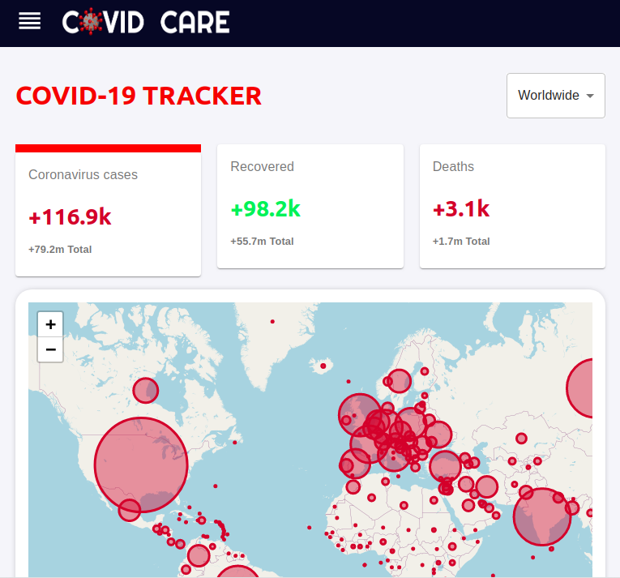

# COVID-CARE  

<p align="center">


 </p>
 
<p align="center">


</p>


<p align="center">
  <a href="https://github.com/Sreejit7/COVID-care">
    
  </a>
</p>


## About

A COVID-19 Website created using [React.js](https://reactjs.org/), [chart.js](https://www.chartjs.org/), [disease.sh API](https://firebase.google.com/) and [GNews API](https://stripe.com/en-in). The website displays global COVID-19 pandemic data like confirmed cases, deaths & recoveries. The data can be varied according to your choice of country, time(24h or all-time). The Headlines section display the **Top-10 COVID-19 related news** accross the globe. The Vaccine Info section displays a list of **Upcoming vaccines and their details**.
## Pre-requisites

* npm
  ```sh
  npm install npm@latest -g
  ```
## Installation

1. Clone this repo:
  ```sh
  git clone https://github.com/Sreejit7/COVID-care.git
  ```
2. Navigate into the project directory:
  ```sh
  cd COVID-care
  ```
3. Install the node-package-manager (npm):
  ```sh
  npm install
  ```
4. Run the project on your local browser:
  ```sh
  npm start
  ```
## Contributing

Contributions are what make the open source community such an amazing place to be learn, inspire, and create. Any contributions you make are **greatly appreciated**.

1. Fork the Project
2. Create your Feature Branch (`git checkout -b feature/AmazingFeature`)
3. Commit your Changes (`git commit -m 'Add some AmazingFeature'`)
4. Push to the Branch (`git push origin feature/AmazingFeature`)
5. Open a Pull Request

## Contact

Let's get in touch and be a part of the dev community together!
* [Portfolio](https://sreejit.dev)
* [LinkedIn](https://www.linkedin.com/in/sreejit-de/)
* [GitHub](https://www.github.com/Sreejit7)
